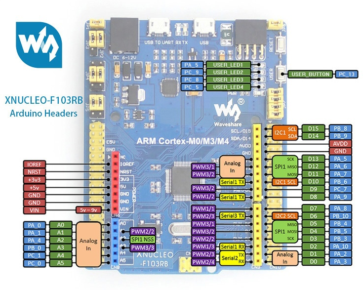

:figure-caption: Рисунок

= Лабораторная №6
:toc:
:toc-title: ОГЛАВЛЕНИЕ

== Задание

* Написать программу, которая по нажатию на User Button зажигает все (4) светодиоды, по следующему нажатию тушит все (4) светодиоды.

** Нужно настроить правильно порты, на Вход,  Medium Speed, без подтяжек, подтяжка на кнопку есть внешняя, поэтому внутренняя не нужна.

== Работа с программой

. Подключаем необходимые шины.
. Назначаем порты диодов на Выход на скорости "Medium Speed", а кнопку на Вход той же скорости.

.Схема подключения портов на плате STM32F411

Код подключения:

[source, c++]
RCC::APB2ENR::SYSCFGEN::Enable::Set();
RCC::AHB1ENR::GPIOAEN::Enable::Set(); // Подключение к шине
RCC::AHB1ENR::GPIOCEN::Enable::Set(); // Подключение к шине
GPIOA::OSPEEDR::OSPEEDR5::MediumSpeed::Set();
GPIOA::MODER::MODER5::Output::Set();
GPIOC::OSPEEDR::OSPEEDR5::MediumSpeed::Set();
GPIOC::MODER::MODER5::Output::Set();
GPIOC::OSPEEDR::OSPEEDR9::MediumSpeed::Set();
GPIOC::MODER::MODER9::Output::Set();
GPIOC::OSPEEDR::OSPEEDR8::MediumSpeed::Set();
GPIOC::MODER::MODER8::Output::Set();
GPIOC::OSPEEDR::OSPEEDR13::MediumSpeed::Set();
GPIOC::MODER::MODER13::Input::Set();

Код программы, которая при нажатии кнопки будет включать или выключать диоды (на кнопке есть внешнаяя подтяжка на уровень "Hight", при нажатии на неё уровень меняется на "Low"), представлен ниже.

[source, c++]
int main()
{
 for (;;)
  {
 if(GPIOC::IDR::IDR13::Low::IsSet())
    {
      //ждем пока не отпуститсся
      while(GPIOC::IDR::IDR13::Low::IsSet())
      {
      }
    led1.Toggle();
    led2.Toggle();
    led3.Toggle();
    led4.Toggle();
    }
     delay(1000000);
}
return 0;
}

== Результат работы программы:

image::1.gif[]
